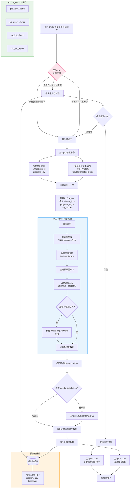

## Test 

```mermaid
flowchart TD
    %% 入口
    A[用户提问 / 设备报警自动触发] --> B{主Agent<br>意图识别}
    %% 模式一：历史报告
    B -->|询问已分析过的报警| C[查询报告存储层]
    C --> D{报告是否存在?}
    D -->|存在| E[取出历史报告]
    E --> F[主Agent LLM<br>基于报告回答用户]
    D -->|不存在| G[转入模式二]
    %% 模式二：新PLC分析
    B -->|需要PLC深度分析| G
    B -->|设备报警自动触发| G
    %% 模式二详细流程
    G --> H[主Agent前置准备]
    H --> H1[根据报警设备/区域<br>预查RAG获取<br>Trouble Shooting Guide]
    H --> H2[解析用户问题<br>提取device_id<br>program_key]
    H1 --> I[组装调用上下文]
    H2 --> I
    I --> J[调用PLC Agent<br>传入: device_id +<br>program_key +<br>rag_context]
    %% PLC Agent内部
    subgraph PLC_Agent [PLC Agent 内部处理]
        direction TB
        J1[接收请求] --> J2[知识库加载<br>PLCKnowledgeBase]
        J2 --> J3[执行回溯分析<br>backward trace]
        J3 --> J4[生成梯形图SVG]
        J4 --> J5[LLM分析生成<br>故障解读 + 处理建议]
        J5 --> J6{是否有信息缺失?}
        J6 -->|有| J7[标记 needs_supplement<br>字段]
        J6 -->|无| J8[组装标准化报告]
        J7 --> J8
    end
    J --> J1
    J8 --> K[返回标准化Report JSON]
    %% 主Agent后处理
    K --> L{检查 needs_supplement?}
    L -->|有缺失| M[主Agent补充查询RAG/SQL]
    M --> N[将补充内容整合到报告]
    L -->|无缺失| N
    N --> O[持久化存储报告]
    O --> P[主Agent LLM<br>组织最终回答]
    P --> Q[返回给用户]
    F --> Q
    %% 报告存储层
    subgraph Storage [报告存储层]
        direction LR
        S1[(报告数据库)]
        S2[Key: alarm_id +<br>program_key +<br>timestamp]
        S1 --- S2
    end
    O --> S1
    C --> S1
    %% PLC Agent暴露的接口
    subgraph API [PLC Agent 对外接口]
        direction LR
        T1[plc_trace_alarm]
        T2[plc_query_device]
        T3[plc_list_alarms]
        T4[plc_get_report]
    end
    %% 样式
    style PLC_Agent fill:#e8f4fd,stroke:#2196F3
    style Storage fill:#fff3e0,stroke:#FF9800
    style API fill:#e8f5e9,stroke:#4CAF50
    style B fill:#fce4ec,stroke:#E91E63
```

this is process